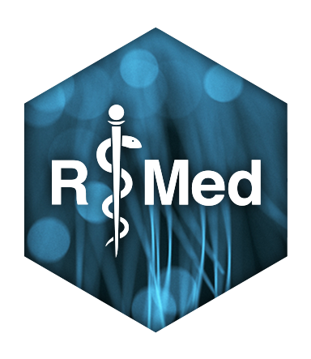

# r-medicine-wg  
R/Medicine Working Group
https://github.com/RConsortium/r-medicine-wg

"R/Medicine" R Consortium working group organizes an annual conference, generally at the end of August, and this has been the primary focus for the past several years. The R/Medicine conference and community promote the development and use of R based tools to improve clinical research and practice. Besides the conference, other activities currently being discussed include:

* book focused on analysis of medical data geared towards medical practitioners
* non-conference workshops
* encouragement of package development for identified gaps (e.g., consort diagrams)