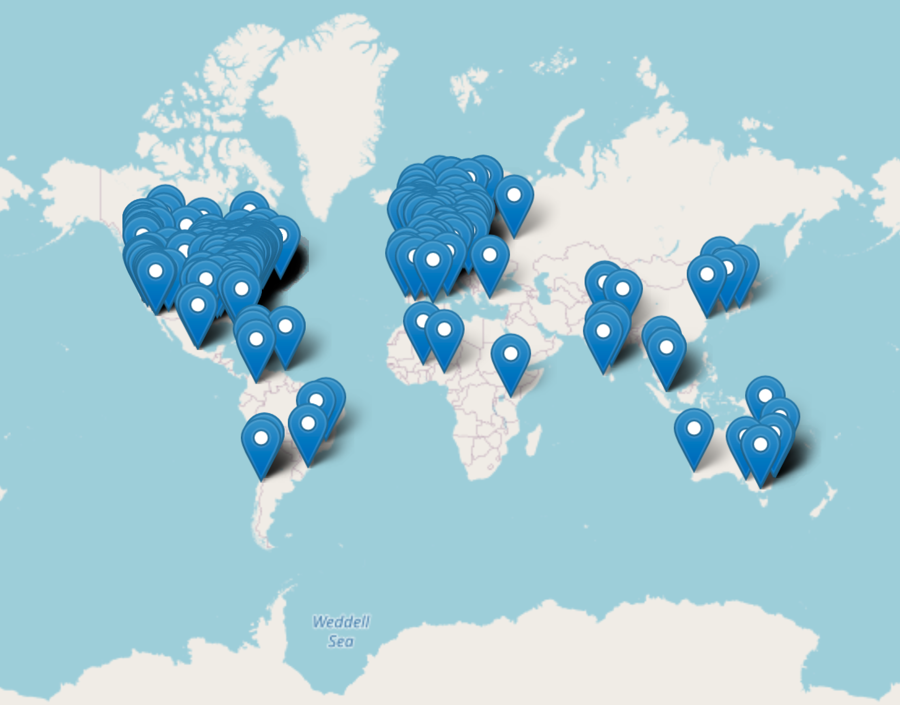

## Introduction

R/Medicine is an active working group of the R consortium, with the goal of supporting R users in medicine, medical research, and related health fields. The group includes a mix of statisticians and physicians who use R regularly in their work, as well as members from RStudio and the R Foundation.  

The 2018 inaugural R/Medicine conference was a two day event held near Yale University with Rob Tibshirani providing the initial keynote address; each day began with a two hour tutorial. In 2019 the conference was held in Boston and included, among others, keynote addresses by Terry Therneau and Frank Harrell. Two half-day workshops were held on the day prior to the conference.  

In 2020, the R/Medicine Working Group organized the third annual R/Medicine conference which was originally planned to be held in Philadelphia. By early April 2020 it was clear that the conference would need to be held virtually.  This article describes some of the challenges as well as unexpected benefits we encountered when pivoting to a virtual conference, with the hope of providing useful information for other conference organizers.  

## Conference Planning and Logistics

Initial planning for the conference began in January 2020. By February, we had 
identified keynote speakers and workshop leaders, and started negotiations with a hotel near
the Children's Hospital of Philadelphia which was 
pegged as the site of the conference. 
However, by the beginning of April we
realized that we would need to switch to a virtual event. 

The initial
challenge for the planning committee was identifying
technology that would allow us to run a main session of presentations,
teach short courses, and host Birds-of-a-Feather (BoF)
activities that allow like-minded R users to network and socialize. Because of our limited budget we had
limited choices for an online conferencing platform.  With help from the
Linux Foundation, which provided recommendations of some of the available conference
platforms, we chose to use Crowdcast (https://www.crowdcast.io). 
This tool was simple to
use for the attendees and the organizers, had a green room to line up
speakers, an interactive chat feature, and the ability to automatically provide a recording of the session
for replay immediately after its conclusion. Compared to other conference platforms, Crowdcast has a rather minimalist set of features. However, feedback from conference participants confirmed 
that the user interface, consisting of a single-track video feed and sidebar participant chat worked well. One downside of Crowdcast was that it did not support screen readers or closed captioning.

For the short courses we chose Zoom (https://zoom.us) as the delivery platform, primarily because of its widespread use and because of a mature breakout room functionality. We found that breakout rooms are a useful tool for teaching, but should be used sparingly, because the overhead of sending participants into breakout rooms can interrupt the flow of teaching the material. For the *Introduction to R for Clinicians* course, we had a meet-and-greet breakout near the beginning of the course as well as a final "Hackathon" breakout in which participants were able to team up to design a dashboard.

Often, the most effective way to teach programming topics is live coding [@Wilson2018]. Much effort has been devoted to create teaching environments that allow participants to live code during a short course without requiring installation of any software. In the R ecosystem, the most notable and laudable effort in this regard is RStudio Cloud (https://rstudio.cloud), which is based on the RStudio Server Integrated Development Environment (IDE). From previous experience teaching R to an audience of clinicians who have no programming experience and are unfamiliar with the R ecosystem, we knew that the RStudio Cloud environment could be challenging because it requires each participant to first register a personal account on the platform before being granted access to the training environment. To address this, we created a training environment with pre-configured generic sequentially numbered training accounts (e.g., `train001`, `train002`, etc.). After receiving training account credentials, a participant could directly access their training environment from a web browser without any further sign-ups. The training environment was implemented as a Docker-based web application based on RStudio Server which was configured with custom R packages and exercise files and hosted on a cloud provider. The application is available for free online [@arsptrain].

Zoom was used for the BoF sessions, and we used Slack for back-channel communication
between the organizers, participants, and presenters. Some Slack channels were created for participants while other channels were limited to the conference planners.  After the conclusion of the conference, all the recorded presentations were loaded onto the
R/Medicine 2020 YouTube channel which is hosted by the R Consortium -@youtube1. Since
September 13, 2020 when the videos were uploaded, there have been over 3,200
views. 
Registration and abstract submission were facilitated by infrastructure
provided by the Linux Foundation.  Google Sheets were used to centralize
organization of the program and the list of volunteers. We used Google Docs for creating conference planning documents and Google Forms for course sign-ups and surveys. 

Since the `@r_medicine` Twitter account has a large following (2,557 as of June 2021), we used Twitter as the main outlet to promote the event. We also directly engaged specific groups that we wanted to participate to improve the conference experience, including R/Ladies, Minorities in R, as well as medical professional organizations including the American Association for Clinical Chemistry (AACC), and Mass Spectrometry & Advances in the Clinical Lab (MSACL).

### Volunteers 

The number of volunteers needed for the virtual conference was significantly higher than for the previous in-person R/Medicine conferences.  For each short course we had at least one teaching assistant for every 10 participants.  Additionally, we had someone monitoring the Zoom chat to escalate issues when necessary. 

For the main session we had two moderators who alternated between speakers in order to orient the upcoming speaker in the green room.  We also had a Crowdcast host who helped behind the scenes and moved participants from one presentation to the next. One person was also in charge of playing any of the talks that were pre-recorded. Each BoF room had a facilitator. Because this was a virtual conference, we also identified back-up volunteers in case there were power outages or issues with internet access. Pre-conference training and discussion sessions were held for short course teaching assistants. Pre-conference technical checks were held prior to the conference for the speakers, instructors, and volunteers. 

## The Conference

In the previous two years, attendance at each conference was around 150 participants. In 2020, 587 people registered for the conference, including 225 students, 185 academics, 104 from industry, and 73 who were working on COVID-19 related projects. Of these, 32% were from outside the United States coming from 43 countries (Figure \ref{fig:map}). Of those who registered, 452 attended at least some sessions live and 431 watched some sessions via the replay feature in Crowdcast. The main conference was held over two days and included 4 keynote addresses, 16 regular talks, 11 lightning talks, and one panel discussion. The schedule included three BoF time slots, each with 4-5 different topics.

```{r map, out.width="70%", fig.align="center", fig.cap="Location of those who registered for the 2020 R/Medicine conference", echo=FALSE}

```


We conducted a brief post-conference survey, which garnered 163 responses. We included the question "How likely are you to recommend this conference to a friend or colleague?" with a 1-5 scale. The "net promoter score", which was calculated by subtracting the fraction of respondents rating the aforementioned question between 1-3 from the fraction of respondents rating it a 5, was 55%. Of all respondents, 98% indicated that they planned to attend R/Medicine in the future.

### Short Courses

Pre-conference events included two short courses presented on the day prior to the conference. The first course, *Introduction to R for Clinicians*, is an adaptation of the popular *Welcome to the Tidyverse* course [@tidyclass] for an audience of healthcare professionals and clinical researchers. The four-hour course placed heavy emphasis on reproducibility and using R Markdown as a computational document format and introduced fundamental concepts of data visualization and data transformation using the `tidyverse` set of tools [@Wickham2019]. Course materials [@introcourse] and recordings [@introhear] are available online. 

The second course, *Introduction to Machine Learning with Tidymodels*, was taught by Alison Hill and focused on the data scientist/statistician audience. This four-hour course aimed to provide a gentle introduction to machine learning with R using the modern suite of predictive modeling packages called `tidymodels`. Participants practiced building, evaluating, comparing, and tuning predictive models interactively. The course introduced fundamental concepts including resampling, overfitting, the holdout method, the bias-variance trade-off, ensembling, cross-validation, and feature engineering; the course materials [@tidycourse] is available online. 

Attendance at the short courses was limited by request of the instructors.
The *Introduction to R for Clinicians* class drew 143 participants, and 80
attended the *Introduction to Machine Learning with Tidymodels* course. Course recordings were available for anyone registered for the conference.  

### Scientific Program

We received 43 abstracts and accepted 25. Additionally, we held space for late-breaking COVID-19 related presentations and for two sponsors. The Scientific Program of the conference was divided into six sessions, each covering a broad theme.

#### R in Clinical Research/Clinical Trials:

This session started with a presentation by Daniela Witten, in which the keynote speaker presented a theoretical framework for re-using data that was collected for testing pre-specified hypotheses to drive new hypothesis generation. Additional sessions focused on analyzing and reporting clinical trial data as well as outlier and anomaly detection in clinical trial data sets.

#### Collaboration/Reproducibility:

The second session started with a keynote by Robert Gentleman in which he outlined the value of large, well-curated data sets as well as how the R ecosystem will be essential for developing new treatments as well as validating and deploying healthcare analytics and clinical decision support tools. Additional talks discussed the `{drake}` and `{holepunch}` packages.

#### New analysis approaches and packages:

The last session of the first day started with a dazzling presentation by Travis Gerke and Garrick Aden-Buie in which the speakers discussed the development of internal R packages. An early prototype of a package for creating CONSORT diagrams was presented, as well as summaries of more mature packages including `{gtsummary}`, `{nDSPA}`, and `{treeheatr}`.

#### R in Clinical Practice, Education, and Bioethics:

The first session of the second conference day started with a keynote speech by Ewen Harrison in which he highlighted the flexibility and ease of using R which makes it an ideal platform for clinician-researchers or other researchers who are not primarily programmers, as well as the collaborative nature of the R community. Additional presentations discussed the role of R in processing laboratory data in clinical practice as well as teaching R to healthcare professionals. Finally, a team presentation by Joy Payton and Paulette McRae highlighted the problematic history of racism in medical research and practice, discussed root causes of bias in data, and offered suggestions to mitigate these biases. 

#### Dashboards and Shiny Apps:

This session discussed a variety of web applications developed using the Shiny framework that were being used either in clinical practice or clinical research.

#### COVID-19 research:

The final session started with a keynote by Patrick Mathias, who shared his experience directing both the clinical operations and operational analytics efforts of one of the busiest clinical COVID-19 testing laboratories in the United States [@covid]. Additional presentations highlighted the role R has played in coordinating the response to the COVID-19 pandemic.

## Lessons learned

Overall, the conference succeeded well beyond our expectations.  Some of the lessons we learned are as follows.

* The chat feature helped build community and allowed active participation in the conference. For instance, some presenters tag-teamed where one person presented and another answered questions via chat as they arose.  Other presenters had pre-recorded their talk and were thus able to answer live questions during the playback of their presentation.  

* Slack was essential for the behind-the-scenes coordination, especially as issues arose.  Additionally, we had participants create their own channels and Zoom sessions for further discussion on certain topics.

* Having back-ups for all the major coordinating roles was essential. Fortunately we had limited issues, but one keynote speaker experienced a power outage, leading to an unavoidable delay.  

* Although Crowdcast allows for smooth transitioning between speakers, time to transition between presenters needs to be built into the schedule, since presenters run over, technical issues emerge, and bio-breaks are important.  It is also wise to build in some flex-time in case there are technical difficulties.     

* During the presentations it was challenging to let speakers know when they were running out of time. All moderators downloaded a app to their phones that allowed them to play a doorbell sound to indicate to the speaker that their time is almost up, however that was not always effective. For 2021 we are planning to require that lightning talks be pre-recorded. 

* Having a virtual meeting greatly expanded our reach. In 2019 we held the conference in Boston and had roughly 150 attendees from a handful of countries whereas in 2020 we had 452 attendees from 43 countries. We hope that the larger attendance will increase our impact as well as our ability to obtain sponsors for future conferences.  

* Recruitment for high caliber keynote speakers was perhaps easier because the time commitment and travel effort were substantially less than for an in-person conference. 

## Sponsors

We would like to thank all the sponsors that supported the 2020 conference: American Association for Clinical Chemistry (AACC), Children's Hospital of Philadelphia (CHOP), Association for Mass Spectrometry & Advances in the Clinical Lab (MSACL), Procogia, the R Consortium, RStudio, and Yale School of Public Health.  

## Acknowledgements

As members of the R/Medicine 2020 Organizing and Programming Committees, we would like to thank all the volunteers who contributed to the success of the conference, the course instructors and teaching assistants, the keynote and contributed speakers, and all the attendees who dialed in from around the globe. 

## Links

Further information about R/Medicine 2020 and the contributions presented during the conference can be found at the conference website: https://events.linuxfoundation.org/r-medicine/

